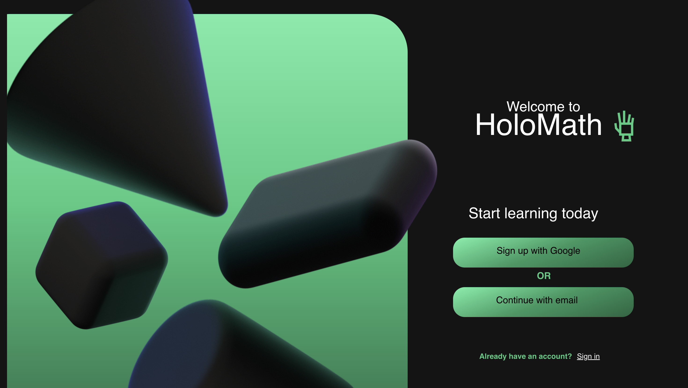
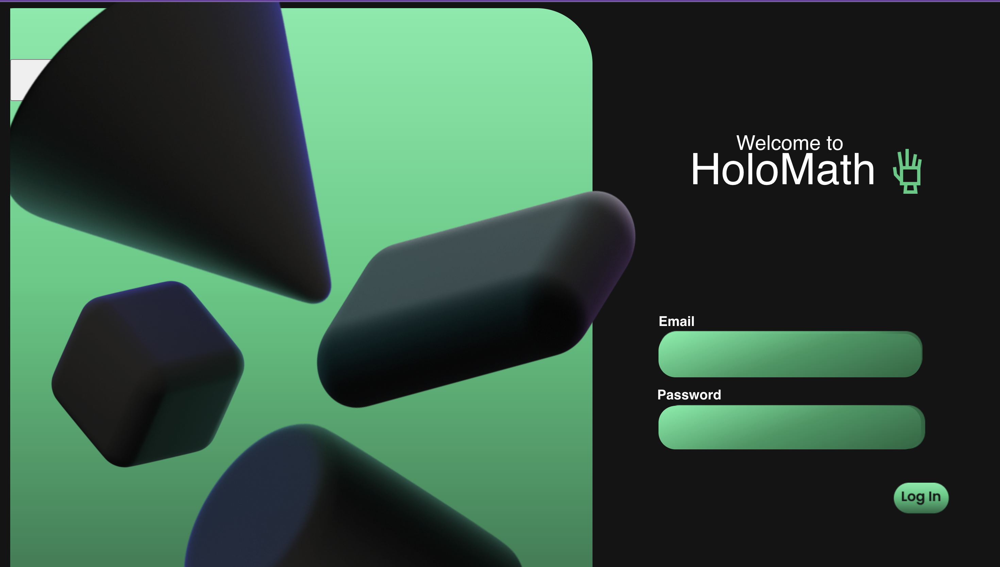
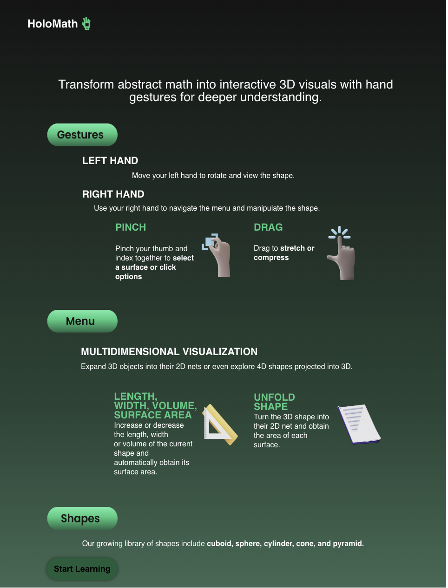

# HoloMath – Interactive 3D Learning Tool


**HoloMath** is an innovative educational tool designed to revolutionize the way students learn mathematics. By leveraging cutting-edge technologies, HoloMath offers an immersive and interactive learning experience that makes complex mathematical concepts more accessible and engaging.

**HoloMath** transforms education by shifting perspectives—from memorization to exploration. Using gesture-based interaction and 3D simulations, it makes abstract concepts tangible. Accessible to all, it fosters curiosity and inclusion.

## Table of Contents

- [Features](#features)
- [Getting Started](#getting-started)
- [Demo](#demo)

## Features

- **Interactive Lessons**: Engage with math lessons through interactive modules that adapt to your learning pace.
- **Gesture-Based Interaction**: Students control 3D mathematical and scientific models using natural hand gestures.
- **No Need for Keyboards or Expensive VR Setups**: Just a webcam and your hands.
- **Multi-Platform Support**: Access HoloMath on various devices, ensuring learning continuity anywhere, anytime.

## Getting Started

Follow these steps to set up HoloMath on your local machine:

1. **Clone the Repository**:

   ```bash
   git clone https://github.com/hieuletainguyen/UofTHack12.git
   ```

2. **Navigate to the Project Directory**:

   ```bash
   cd UofTHack12
   ```

3. **Install Dependencies**:

   For the client:

   ```bash
   cd client
   npm install
   ```

   For the server:

   ```bash
   cd server
   npm install
   ```

4. **Start the Development Server**:

   For the client:

   ```bash
   npm start
   ```

   For the server:

   ```bash
   npm start
   ```

5. **Access the Application**:

   Open your browser and navigate to `http://localhost:3000` to start using HoloMath.


## Demo

### Demo video


<div align="center">
  
[](https://youtu.be/9yxT5CcscZQ)

<p align="center"><em>Click the image above to watch the demo video</em></p>

</div>

### Screenshots

<div align="center">



Home Page



Login Page



Tutorial Page


Interactive Page

</div>


<h2 align="center"> Tools We Have Used and Learned In This Project</h2>
<p align="center">


</p>

<div align="center">
  
